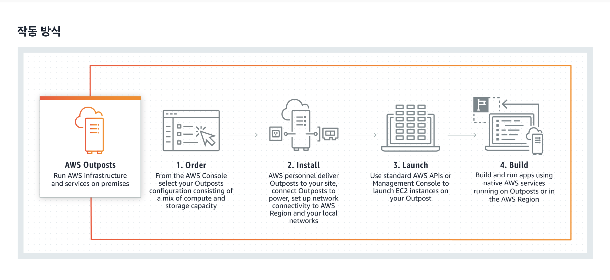

# AWS outposts 란?

AWS outposts 는 일관된 하이브리드 환경을 위해 AWS 인프라, AWS 서비스, API 및 도구를 모든 데이터 센터, 코로케이션 공간, 온프레미스 시설로 확장하는 완전관리형 서비스입니다. AWS Outposts 는 온프레미스 시스템, 로컬 데이터 처리 또는 로컬 데이터 스토리지에 대한 지연 시간이 짧은 액세스가 필요한 워크로드에 적합합니다.

하이브리드 클라우드 환경, 즉, AWS 와 온프레미스 환경을 함께 사용하는 경우에 AWS 인프라 및 서비스를 온프레미스 IDC 에 넣고 사용할 수 있도록 해주는 서비스이다.

아래와 같은 순서로 AWS console 에 접속해서 주문을 하여 시작할 수 있다.

요금은 스펙에 따라 다른데, 선결제 옵션으로 선불로 구매할 수도 있다.

운영체제나 서비스 요금, 데이터 전송 요금은 따로 부과가 되기 때문에 이것을 따져보고 구매를 진행해야 한다.

> 출처
https://aws.amazon.com/ko/outposts/
https://aws.amazon.com/ko/outposts/pricing/
